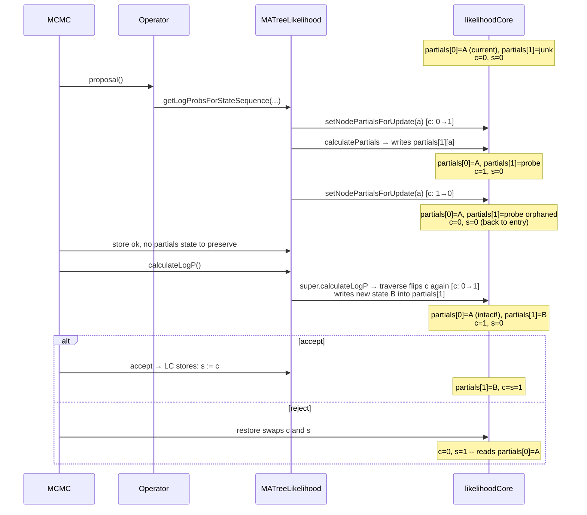

# Probe APIs and the store/restore lifecycle

In this document, **probe** means a speculative call to
`MATreeLikelihood.getLogProbsForStateSequence(nodeNr, sites)` (or its
partials variant `getLogProbsForPartialsSequence`): the caller is asking
*what would the per-site log likelihoods be if leaf `nodeNr` had this
sequence?* without committing to it as the new state. Gibbs-style
operators issue many such probes per proposal to build up their proposal
distribution.

The probe walks from `nodeNr` up to the root, recomputing partials at
every ancestor — which writes into BEAST2's `LikelihoodCore` buffers.
That side effect is the source of all the subtleties below: it has to be
managed against BEAST2's store/restore lifecycle so that the cached
partials representing the current accepted state survive untouched.

## The buffer model

`BeerLikelihoodCore` double-buffers internal-node partials with two
per-node arrays and a `currentPartialsIndex[a]` (call it `c`) that selects
the live slot, plus a `storedPartialsIndex[a]` (call it `s`) used by
`restore()`. After `store()` (which copies `c → s`), both `c` and `s` point
to the same data slot — that's the "stored" state to roll back to.

`setNodePartialsForUpdate(a)` flips `c[a]`. The contract is: callers flip
*before* writing new partials, so writes land in the scratch slot and the
stored slot stays intact. `restore()` swaps the index arrays, which has
the effect of pointing `c` back at the stored slot.

Tip states (when `useAmbiguities=false`) are *not* double-buffered —
there's a single `int[] states[nodeIndex]`. `MATreeLikelihood` patches over
this with `tempTipNodes` (track which tips were probed) and resync from
`MutableAlignment` in `restore()`. This piece is unavoidable.

## The MCMC iteration timing

In one MCMC iteration, the framework calls (in order):

1. `state.store(sample)` — bookkeeping only, doesn't touch CalculationNodes
2. `operator.proposal()` — *probes happen here*
3. `state.storeCalculationNodes()` → `MATreeLikelihood.store()` — **after** the proposal, **before** evaluation
4. `posterior.calculateLogP()` → `MATreeLikelihood.calculateLogP()`
5. accept → `acceptCalculationNodes()`, or reject → `state.restore()` + `restoreCalculationNodes()`

Step 3 sits between probes (step 2) and evaluation (step 4). Any
probe-tracking state that needs to survive into `calculateLogP()` must
either (a) survive `store()` unchanged, or (b) not exist at all by the
time `store()` runs. The design below takes path (b) for partials and
path (a) for the tip-state tracking that `BeerLikelihoodCore`'s
single-buffered tip layout forces on us.

## Hermetic probes

`calcPatternLogLikelihoods` is hermetic: it flips each touched ancestor's
partials index to the scratch slot before writing, computes pattern log
likelihoods at the root, then flips each ancestor back. After the probe
call returns, the partials indices are exactly what they were on entry —
the probe leaves *no trace* in the `LikelihoodCore`'s buffer indices for
the framework's store/restore to mishandle.

For tip states, `tempTipNodes` is still needed and `store()` must not
clear it — that is the one cross-method invariant left.

## Why this is the cleanest available design

- **Tip states must use `tempTipNodes`.** `setNodeStatesForUpdate` is a
  no-op in `BeerLikelihoodCore`, so probes that mutate leaf states have
  to resync from `MutableAlignment` in `restore()` regardless of what
  partials handling we choose. BEAGLE's tip states aren't double-buffered
  either, so the `BeagleMATreeLikelihood` path needs the same workaround.
- **Partials don't need cross-method state.** The "flip up, compute,
  flip back" pattern is local to `calcPatternLogLikelihoods` and leaves
  no cross-method invariants (other than the one tip-state set we already
  need). No `store()`/`accept()`/`restore()` machinery to keep in sync.
- **BEAGLE's rescale recursion is handled** by threading the per-call
  `flipped` set through the recursive call, so each ancestor is still
  flipped at most once across rescale attempts and flipped back exactly
  once on the final success path.

## Edge case left open

If an operator uses probes and then returns `Double.NEGATIVE_INFINITY`,
MCMC's failure path calls `state.restore()` but skips
`restoreCalculationNodes()` (when the operator's
`requiresStateInitialisation()` is `true`, the default). `MA.restore()`
never runs, so `tempTipNodes` is not cleared and the tip states are not
resynced.

For partials this is harmless — the hermetic flip-up/flip-back already
happened inside the probe call, so the buffer indices are clean. For tip
states, the next probe in the next iteration would write fresh states
(overwriting the stale ones) before computing, so single-probe operators
still get the right answer. Cross-iteration state leakage of
`tempTipNodes` is a small leak, not a correctness bug.

This isn't triggered by `phylonco`'s `ExchangeGibbsOperator` (all its
`NEGATIVE_INFINITY` early-returns happen *before* the first probe) but
worth knowing if any future probe-using operator returns
`NEGATIVE_INFINITY` post-probe.
